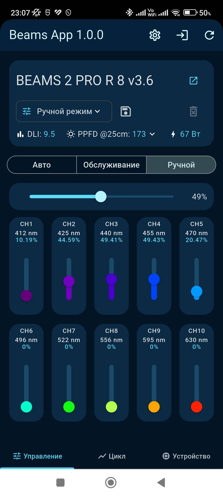
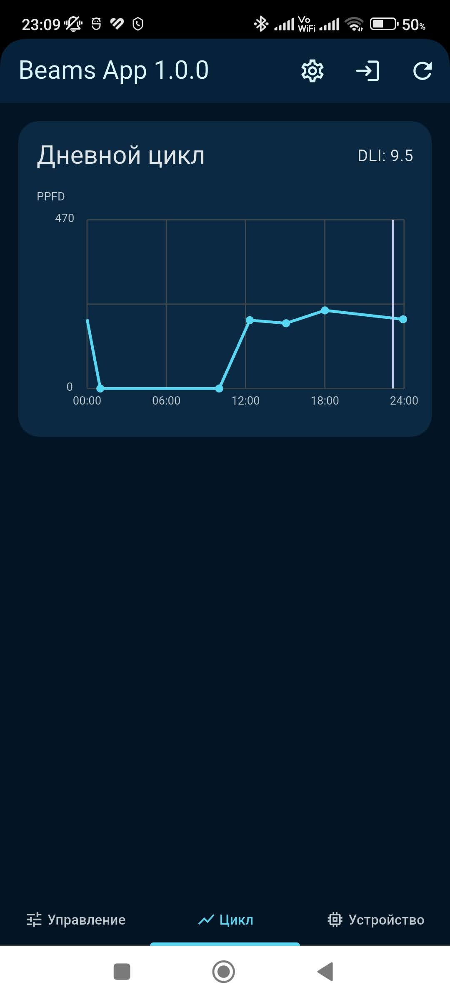
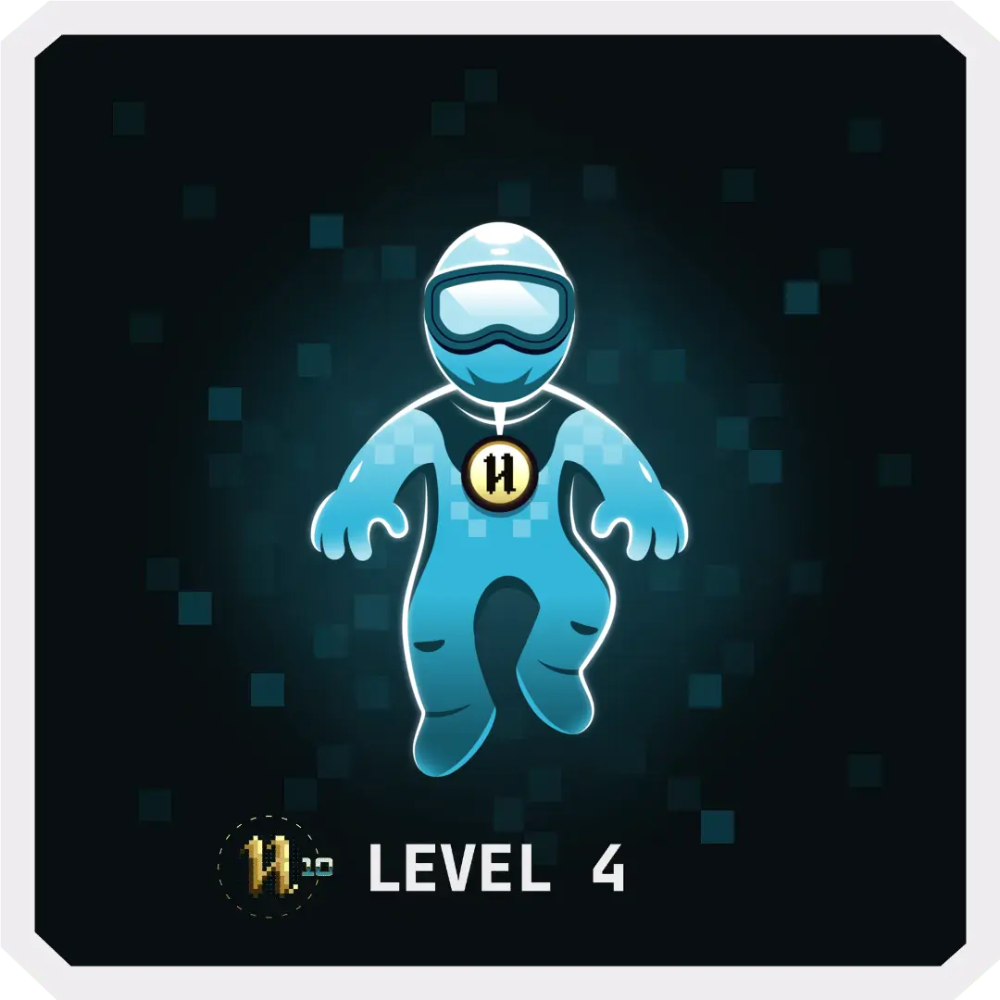
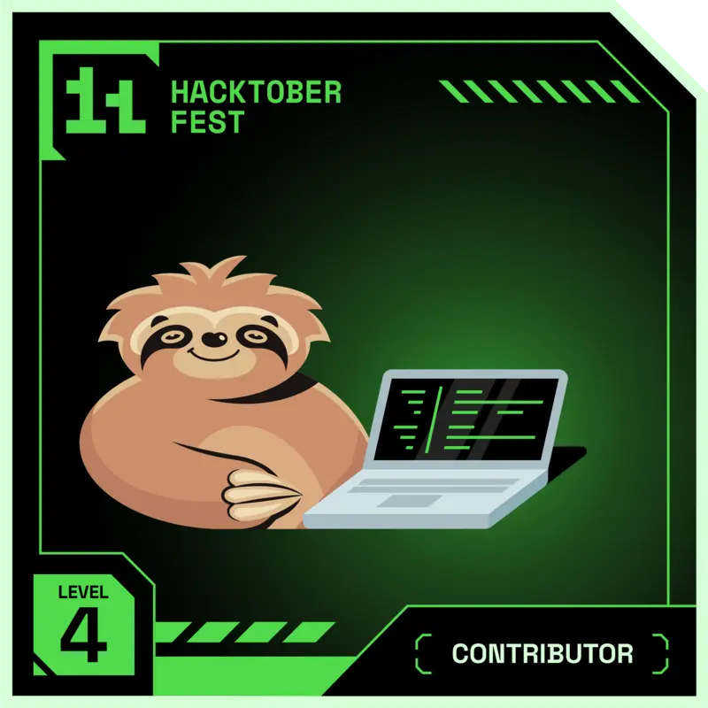
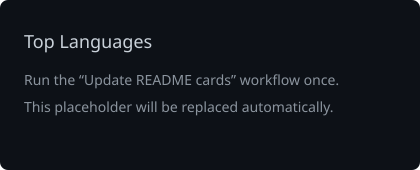

# `realdigger`

### Open Source · Home Automation · Mobile Apps · Forum Development

[GitHub](https://github.com/realdigger) · [MySMF](https://mysmf.net)

---

## About

I build practical tools around **automation, local control and open source**.

I also have extensive experience with **PHP** and the **Simple Machines Forum (SMF)**
ecosystem, including developing numerous custom modifications and extending forum
functionality.

Current projects focus on the **BEAMS aquarium lighting ecosystem**:
a Home Assistant integration and a Flutter Android app for direct local control.

> If I have to do something twice, I'll probably automate it.

---

## Tech

`PHP` `Python` `Flutter` `Dart` `Android` `Linux` `Docker` `Git` `GitHub`

`SMF` `MySQL` `HTML` `CSS` `JavaScript` `Home Assistant` `HACS`

### Forum Development

**Simple Machines Forum (SMF)** — extensive experience developing custom
modifications, extending forum functionality and adapting the engine for real-world
use cases.

Some SMF work:

- [SMF Mods Russian Localization](https://github.com/realdigger/SMF-Mods-Russian-Localization)
- [SMF SAVE Fix](https://github.com/realdigger/SMF-SAVE-Fix)
- [SMF Allowed Email Domains](https://github.com/realdigger/SMF-Allowed-Email-Domains)

---

## Featured Projects

### BEAMS Light for Home Assistant

Unofficial **Home Assistant custom integration** for local control and monitoring of
**BEAMS reef aquarium lights**.

- Overall brightness and 10 spectral channel controls
- Auto, manual and service modes
- Spectrum selection
- DLI and PPFD sensors
- Diagnostic and controller sensors
- Built-in Lovelace cards
- HACS installation

`Home Assistant` `Python` `HACS` `Lovelace`

**[View repository →](https://github.com/realdigger/home-assistant-beams)**

 

### BEAMS App

Android app for **local control of BEAMS aquarium lights**.

The app connects directly to compatible lights on the local network without requiring
cloud control.

- Local light discovery
- Direct connection by IP, hostname or URL
- Automatic reconnect
- Manual and service modes
- Spectrum management
- Daily cycle control
- Device and diagnostic information
- Russian and English UI

`Flutter` `Dart` `Android`

**[View repository →](https://github.com/realdigger/beams-app)**

 

&nbsp;&nbsp;

---

## Hacktoberfest

&nbsp;&nbsp;

&nbsp;&nbsp;

  

`2023 — Level 4` · `2024 — Level 4` · `2025 — Supercontributor`

---

## GitHub Stats

---

## Languages

---

Build useful things · Keep them local · Share them openly

